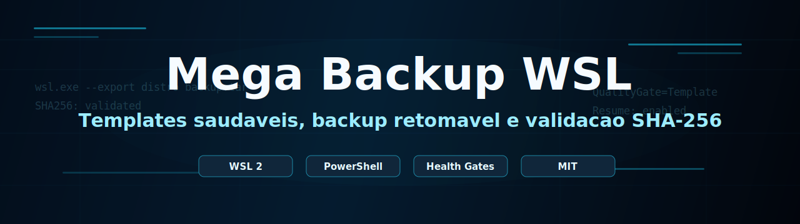
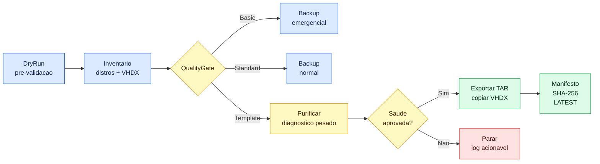

<p align="center">
  
</p>

<p align="center">
  <a href="LICENSE"></a>
  
  
  
  
</p>

<h1 align="center">Mega Backup WSL</h1>

<p align="center">
  Backup profissional para WSL no Windows, com distros tratadas como templates, VHDX extra, retomada automatica, health gates e publicacao segura.
</p>

<p align="center">
  <a href="#inicio-rapido">Inicio rapido</a> ·
  <a href="#comandos-principais">Comandos</a> ·
  <a href="#experiencia-do-terminal">Terminal</a> ·
  <a href="#interface-wpf">Interface</a> ·
  <a href="#documentacao">Documentacao</a> ·
  <a href="#estrutura-do-backup">Estrutura</a> ·
  <a href="#licenca">Licenca</a>
</p>

---

## Visao Geral

| Area | Entrega |
| --- | --- |
| **Backup completo** | Exporta distros WSL e copia `WSL_Drives.vhdx` |
| **Templates saudaveis** | Purifica, diagnostica e bloqueia distros ruins antes de exportar |
| **Retomada automatica** | Continua a partir de `_staging` quando uma execucao falha |
| **Integridade** | Valida TAR/VHDX com SHA-256 e gera manifesto |
| **Operacao segura** | Usa lock, staging, logs, retencao e publicacao atomica |

> [!IMPORTANT]
> O script executa `wsl.exe --shutdown` durante backups reais. Feche terminais, editores e servicos dentro das distros antes de iniciar.

## Experiencia Do Terminal

O terminal foi tratado como uma interface de operacao: cada linha precisa dizer o que esta acontecendo, qual o nivel de risco e qual proximo passo fica seguro. A saida evita blocos soltos, quebra mensagens longas e usa estados consistentes para facilitar leitura em execucoes longas.

Imagem demonstrativa do fluxo de operacao:



| Estado | Cor esperada | Como ler |
| --- | --- | --- |
| `[INFO]` | Neutro | Contexto, inventario, estimativas e passos em andamento |
| `[OK]` | Verde | Etapa concluida e validada |
| `[WARN]` | Amarelo | Algo merece atencao, mas o script ainda pode continuar |
| `[ERROR]` | Vermelho | Parada segura; veja o log antes de tentar novamente |

> [!NOTE]
> Esta UX se espelha no [CLI Guidelines](https://clig.dev/) para clareza, robustez e saida humana, e na documentacao do [Write-Host](https://learn.microsoft.com/en-us/powershell/module/microsoft.powershell.utility/write-host?view=powershell-7.6) para exibicao controlada com cores no PowerShell.

## Inicio Rapido

### 

Abra o menu interativo e escolha o tipo de backup.

```bat
D:\config_wsl\backup_distro_wsl\backup_all\launchers\Escolher_Backup_WSL.cmd
```

### 

Abra a interface grafica em C#/.NET WPF.

```bat
D:\config_wsl\backup_distro_wsl\backup_all\dist\MegaBackupWsl.exe
```

O atalho `launchers\Abrir_Interface_WPF.cmd` tambem abre esse `.exe` quando ele ja existe.

### 

Valide tudo sem exportar distros nem copiar o VHDX.

```bat
D:\config_wsl\backup_distro_wsl\backup_all\launchers\Executar_Mega_Backup_WSL.cmd -BackupMode All -DryRun
```

### 

Limpe e valide as distros como base de clones, sem publicar backup.

```bat
D:\config_wsl\backup_distro_wsl\backup_all\launchers\Executar_Mega_Backup_WSL.cmd -BackupMode Distros -PurifyOnly -QualityGate Template
```

### 

Execute em um clique a rotina mais exigente: primeiro purifica as distros em modo Template e, se tudo passar, roda o backup completo.

```bat
D:\config_wsl\backup_distro_wsl\backup_all\launchers\Executar_Full_Template.cmd
```

### 

Gere backup de distros + `WSL_Drives.vhdx` com exigencia de template.

```bat
D:\config_wsl\backup_distro_wsl\backup_all\launchers\Executar_Mega_Backup_WSL.cmd -BackupMode All -QualityGate Template
```

## Comandos Principais

| Objetivo | Comando |
| --- | --- |
|  | `launchers\Abrir_Interface_WPF.cmd` |
|  | `launchers\Escolher_Backup_WSL.cmd` |
|  | `launchers\Executar_Mega_Backup_WSL.cmd -BackupMode All` |
|  | `launchers\Executar_Mega_Backup_WSL.cmd -BackupMode Distros` |
|  | `launchers\Executar_Backup_WSL_Drives_VHDX.cmd` |
|  | `launchers\Executar_Mega_Backup_WSL.cmd -BackupMode Distros -HealthOnly` |
|  | `launchers\Executar_Mega_Backup_WSL.cmd -BackupMode Distros -HealthOnly -DeepHealth` |
|  | `launchers\Executar_Full_Template.cmd` |
|  | `launchers\Executar_Mega_Backup_WSL.cmd -BackupMode All -QualityGate Template` |
|  | `launchers\Executar_Mega_Backup_WSL.cmd -OrganizeRuns` |
|  | `launchers\Executar_Mega_Backup_WSL.cmd -BackupMode All -ResumeRunId RUN_ID` |

> [!TIP]
> Use `-PurifyOnly -QualityGate Template` antes de criar uma distro-template importante. Ele remove sockets temporarios, tenta limpar journal antigo, roda diagnostico pesado e para sem exportar.

## Interface WPF

A interface grafica pronta fica em `dist\MegaBackupWsl.exe` e chama o motor PowerShell em `scripts\Mega_Backup_WSL.ps1`.

| Acao | O que faz |
| --- | --- |
| `Simular Organizacao` | Mostra como os backups publicados seriam separados por qualidade |
| `Organizar Diretorios` | Move backups antigos para `Runs\Basic`, `Runs\Standard` e `Runs\Template` |
| `DryRun Completo` | Valida configuracao sem exportar distro nem copiar VHDX |
| `Saude Das Distros` | Executa diagnostico das distros |
| `Full Template` | Purifica, valida e executa backup completo com `QualityGate Template` |

> [!NOTE]
> O `.exe` pronto em `dist\MegaBackupWsl.exe` foi compilado pela versao rapida em `src\MegaBackupWsl.FastWpf`, usando o `csc.exe` do Windows. O projeto completo em `src\MegaBackupWsl.App` continua disponivel para builds com .NET 8 SDK.

## Modos E Gates

### Modos De Backup

| Modo | Quando usar | Resultado |
| --- | --- | --- |
| `All` | Backup completo | Distros + `WSL_Drives.vhdx` |
| `Distros` | Templates ou restauracao de distros | Somente arquivos `.tar` |
| `Vhdx` | Copia rapida do disco extra | Somente `WSL_Drives.vhdx` |

### Quality Gates

| Gate | Perfil | Bloqueia |
| --- | --- | --- |
| `Basic` | Emergencia | Quase nada; prioriza gerar backup |
| `Standard` | Uso normal | Problemas criticos de filesystem, escrita ou montagem |
| `Template` | Base para clones | Sockets, read-only, erro de diretorio, falha de escrita e sinais fortes de filesystem ruim |

## Documentacao

| Topico | Link |
| --- | --- |
| Primeira execucao | [docs/QUICKSTART.md](docs/QUICKSTART.md) |
| Parametros e exemplos | [docs/USAGE.md](docs/USAGE.md) |
| Health gates e templates | [docs/HEALTH_GATES.md](docs/HEALTH_GATES.md) |
| Interface grafica | [docs/INTERFACE_WPF.md](docs/INTERFACE_WPF.md) |
| Restauracao e clones | [docs/RESTORE.md](docs/RESTORE.md) |
| Arquitetura e retomada | [docs/ARCHITECTURE.md](docs/ARCHITECTURE.md) |
| Erros comuns | [docs/TROUBLESHOOTING.md](docs/TROUBLESHOOTING.md) |

## Estrutura Do Backup

Use `launchers\Executar_Mega_Backup_WSL.cmd -OrganizeRuns` para mover backups antigos ja publicados para a estrutura por qualidade, sem exportar distros e sem copiar VHDX.

```text
F:\Backup\WSl_backup
|-- LATEST.txt
|-- LATEST-Template.txt
|-- logs
|   `-- Mega_Backup_WSL_RUN_ID.log
`-- Runs
    |-- Basic
    |   |-- LATEST.txt
    |   `-- Basic-RUN_ID
    |-- Standard
    |   |-- LATEST.txt
    |   `-- Standard-RUN_ID
    `-- Template
        |-- LATEST.txt
        `-- Template-RUN_ID
            |-- checksums.sha256
            |-- manifest.json
            |-- RESTORE_GUIDE.txt
            |-- resume_state.json
            |-- distros
            |   |-- Ubuntu.tar
            |   `-- kali-linux.tar
            `-- workspace
                `-- WSL_Drives.vhdx
```

## Arquivos Do Projeto

```text
backup_all
|-- assets
|-- docs
|-- launchers
|-- src
|-- scripts
|-- LICENSE
`-- README.md
```

| Arquivo | Funcao |
| --- | --- |
| `scripts\Mega_Backup_WSL.ps1` | Motor principal |
| `dist\MegaBackupWsl.exe` | Interface grafica pronta para abrir com duplo clique |
| `src\MegaBackupWsl.App` | Interface grafica C#/.NET WPF |
| `src\MegaBackupWsl.FastWpf` | Fonte da interface WPF rapida, compilada sem SDK |
| `scripts\Build-MegaBackupWslFastExe.ps1` | Regera `dist\MegaBackupWsl.exe` com o compilador do Windows |
| `launchers\Abrir_Interface_WPF.cmd` | Atalho para abrir/compilar a interface |
| `launchers\Escolher_Backup_WSL.cmd` | Menu interativo |
| `launchers\Executar_Mega_Backup_WSL.cmd` | Atalho geral |
| `launchers\Executar_Full_Template.cmd` | Atalho maximo: purifica como template e depois roda backup completo |
| `launchers\Executar_Backup_WSL_Drives_VHDX.cmd` | Atalho para VHDX |
| `docs/` | Guias por topico |
| `assets/` | Imagens do README |

## Disciplina De Commits

O projeto adota uma disciplina inspirada no Fabio Akita: commits pequenos, uma coisa por commit, stage explicito por arquivo e revisao do diff antes de gravar. Quando uma alteracao mistura assuntos, ela deve ser separada com `git add -p`, `git add -i` ou commits independentes.

```bat
git status
git diff
git add README.md
git diff --staged
git commit -m "docs: improve readme terminal guidance"
```

## Referencias

- [Basic commands for WSL](https://learn.microsoft.com/en-us/windows/wsl/basic-commands)
- [FAQ about WSL](https://learn.microsoft.com/en-us/windows/wsl/faq)
- [How to manage WSL disk space](https://learn.microsoft.com/en-us/windows/wsl/disk-space)
- [Troubleshooting WSL](https://learn.microsoft.com/en-us/windows/wsl/troubleshooting)
- [CLI Guidelines](https://clig.dev/)
- [Write-Host - Microsoft Learn](https://learn.microsoft.com/en-us/powershell/module/microsoft.powershell.utility/write-host?view=powershell-7.6)
- [About READMEs - GitHub Docs](https://docs.github.com/en/repositories/managing-your-repositorys-settings-and-features/customizing-your-repository/about-readmes)
- [Readme Best Practices](https://github.com/jehna/readme-best-practices)
- [Best Practices for README files](https://utrechtuniversity.github.io/workshop-computational-reproducibility/chapters/readme-files.html)
- [Akitando #71 - Usando Git Direito](https://akitaonrails.com/2020/02/12/akitando-71-usando-git-direito-limpando-seus-commits/)

## Licenca

Distribuido sob a licenca MIT. Veja [LICENSE](LICENSE).
