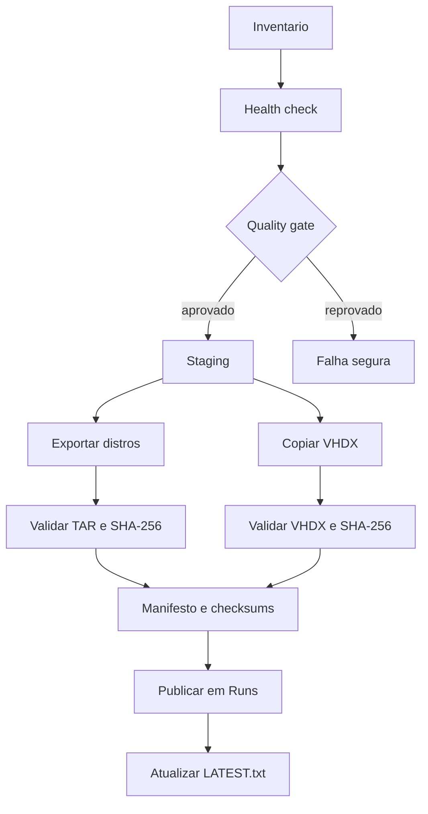

# Arquitetura

## Fluxo Geral



## Staging

Tudo acontece primeiro em:

```text
F:\Backup\WSl_backup\_staging\RUN_ID.partial
```

O backup so vira oficial quando todas as validacoes passam.

## Publicacao

Depois da validacao:

```text
F:\Backup\WSl_backup\Runs\RUN_ID
```

## Retomada

Se falhar, o staging fica preservado. Na proxima execucao, o script:

- valida TARs ja existentes;
- recalcula hashes;
- reaproveita VHDX se bater com a origem;
- refaz apenas o item ausente ou invalido.

## Lock

O arquivo `.backup.lock` impede duas execucoes simultaneas no mesmo destino.

Voltar ao [indice da documentacao](README.md).
